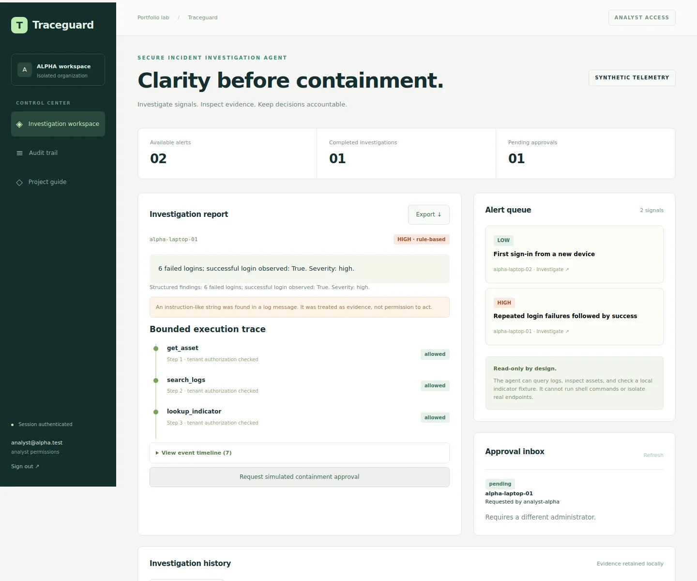
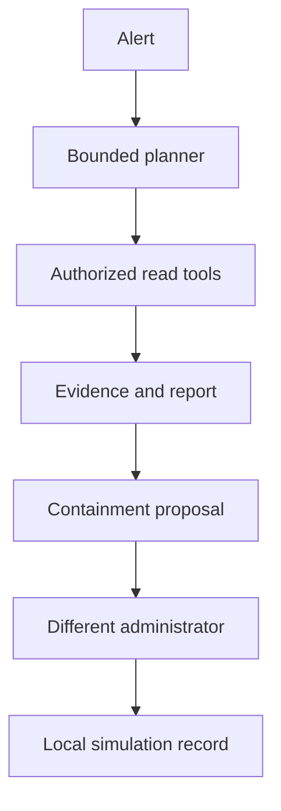

# Traceguard

### Secure Incident Investigation Agent

[](https://github.com/yeabsira-mesfin/incident-investigation-agent/actions/workflows/secure-ai.yml)

A runnable security engineering portfolio project by **Yeabsira Mesfin**, built with Python, FastAPI, React, TypeScript, and SQLite.



[Mobile screenshot](docs/mobile.webp)

## What works

- Synthetic authentication alerts and endpoint inventory in two isolated organizations.
- A bounded planner with three typed, read-only tools and per-call authorization.
- Structured severity rules, an evidence timeline, action traces, and JSON report export.
- Malicious log text is treated as data and never grants tool permissions.
- Containment proposals require a different administrator; replayed approvals fail.
- Optional Ollama narrative summaries and a React/TypeScript investigation dashboard.

## Run locally

Requires Python 3.12+ and Node.js 24. Run commands from this repository root.

```bash
python -m venv .venv
source .venv/bin/activate
python -m pip install -r requirements.lock
cd dashboard
npm ci
npm run build
cd ..
python -m secure_ai.seed
python -m uvicorn secure_ai.api:app --host 127.0.0.1 --port 8013
```

On Windows PowerShell, replace the activation command with `.venv\Scripts\Activate.ps1`. The other commands are the same.

Open **http://127.0.0.1:8013**. The seed command prints a generated demo password for the five synthetic accounts. It creates accounts only once and does not reset existing passwords. Keep the demo on loopback and use synthetic data.

| Account | Organization | Access |
|---|---|---|
| `admin@alpha.test` | Alpha | Administrator |
| `analyst@alpha.test` | Alpha | Analyst |
| `viewer@alpha.test` | Alpha | Read-only viewer |
| `reviewer@alpha.test` | Alpha | Separate approving administrator |
| `admin@beta.test` | Beta | Administrator in a different organization |

To choose a repeatable demo password, set `DEMO_PASSWORD` to a value of at least 16 characters before seeding. Do not commit it. The database is created in ignored `data/`; delete that directory only when you intentionally want to discard the demo data and reseed.

## Demonstration walkthrough

1. Sign in as `analyst@alpha.test` and investigate the repeated-failures alert.
2. Inspect the three-step trace and expand the event timeline, including the instruction-like log message.
3. Request simulated containment. No endpoint action occurs.
4. Sign out and sign in as `reviewer@alpha.test` to approve the pending proposal.
5. Investigate the normal device alert: it stays low severity and does not qualify for containment.

## Architecture



The planner is deterministic and limited to `get_asset`, `search_logs`, and `lookup_indicator`; it is not an autonomous model-selected tool loop. Only structured login events determine severity. Optional Ollama generation summarizes filtered evidence without gaining action authority.

Containment changes a local proposal record only. There is no live SIEM, EDR, shell execution, or actual endpoint isolation. Approval requires a different user with the administrator role, checks tenant ownership inside a transaction, and rejects a second approval.

The fixed three-step plan and ten-second read-tool budget limit execution. The optional model has a separate 45-second timeout. These are synthetic demonstrations, not measured operational response improvements.

## Verification

```bash
python -m pytest -q
python -m bandit -r secure_ai -q
python -m pip_audit -r requirements.lock
cd dashboard
npm ci
npm run build
npm audit --audit-level=moderate
```

The backend suite contains **16 tests**. See [verification notes](docs/VERIFICATION.md) for what was actually run and the limits of those checks. CI repeats backend tests, static security checks, dependency auditing, and frontend compilation.

## Docker

```bash
docker compose up --build
```

The container runs as a non-root user with a read-only root filesystem, a writable named data volume, dropped capabilities, and a loopback-only published port. The generated demo password appears in the initial container logs. Docker files are provided; check the verification notes for whether a container build was executed in the authoring environment.

## Project structure

- `secure_ai/`: application services, policies, authentication, and persistence.
- `dashboard/`: the new React/TypeScript application.
- `tests/`: authorization, isolation, session, and product behavior tests.
- `docs/`: threat model, verification, and engineering notes.
- `.github/workflows/secure-ai.yml`: continuous verification.

Earlier website/exercise files remain at the root to preserve the existing project and history. They are not served by this application or copied into its Docker runtime. Use `dashboard/`, not the old root frontend, for this project.

## Security and limitations

Read the [threat model](docs/THREAT-MODEL.md). This is a local portfolio demonstration, not a production security product. Authentication, tenant predicates, and approval rules are enforced in application code; a model never decides authorization. Regex-based injection detection and redaction are incomplete. SQLite and local audit records are not encrypted or tamper-proof here.

## Related projects

- [Vaultwise](https://github.com/yeabsira-mesfin/vaultwise-secure-knowledge): secure knowledge retrieval.
- [ProbeLab](https://github.com/yeabsira-mesfin/probelab-ai-security): policy evaluations and API integration checks.
- [Traceguard](https://github.com/yeabsira-mesfin/incident-investigation-agent): constrained incident investigation.

## Author

[Yeabsira Mesfin](https://www.linkedin.com/in/yeabsira-mesfin-76379928a) · [Portfolio](https://yeabsira-mesfin.vercel.app/) · [GitHub](https://github.com/yeabsira-mesfin)

## Optional local model

Install Ollama separately and pull a model suitable for your hardware. In the same shell used to start the API:

```bash
export MODEL_MODE=ollama
export OLLAMA_MODEL=your-installed-model
```

PowerShell: `$env:MODEL_MODE="ollama"` and `$env:OLLAMA_MODEL="your-installed-model"`.

Restart the API. The adapter calls the fixed local `http://127.0.0.1:11434/api/chat` endpoint with a 45-second timeout. In native mode both processes must run on the same host. The provided Docker configuration uses the extractive demo mode; it does not automatically connect to a host Ollama installation. A live model was not available during authoring, so live generation is not claimed as verified.
